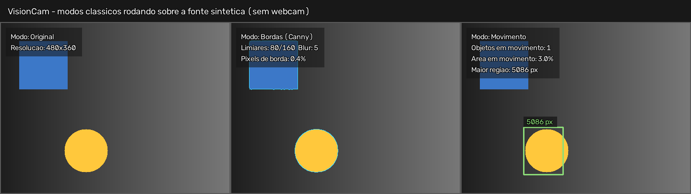
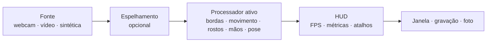

# VisionCam

App de **visão computacional em tempo real** com webcam, construído com OpenCV e MediaPipe.
Seis modos que você alterna com o teclado enquanto o vídeo roda: desde detecção de bordas
clássica até rastreamento de mãos com contagem de dedos e estimativa de pose.

O projeto foi escrito para ser **lido**: cada etapa do pipeline mora em um arquivo pequeno,
com comentários explicando *por que* cada decisão foi tomada — não só o que o código faz.



---

## Índice

- [O que dá para fazer](#o-que-dá-para-fazer)
- [Instalação](#instalação)
- [Como usar](#como-usar)
- [Atalhos de teclado](#atalhos-de-teclado)
- [Como funciona](#como-funciona)
- [Estrutura do projeto](#estrutura-do-projeto)
- [Criando um modo novo](#criando-um-modo-novo)
- [Decisões técnicas interessantes](#decisões-técnicas-interessantes)
- [Testes](#testes)
- [Limitações e próximos passos](#limitações-e-próximos-passos)

---

## O que dá para fazer

| Tecla | Modo | O que faz | Precisa de modelo? |
|:-----:|------|-----------|:------------------:|
| `1` | **Original** | Vídeo puro. Serve de referência de FPS. | não |
| `2` | **Bordas** | Canny: cinza → desfoque → gradiente → limiares. Visão computacional clássica, sem rede neural. | não |
| `3` | **Movimento** | Subtração de fundo (MOG2) + contornos. Conta e enquadra o que se mexe. | não |
| `4` | **Rostos** | BlazeFace: caixa, confiança e 6 pontos-chave por rosto. | sim |
| `5` | **Mãos** | 21 pontos por mão, contagem de dedos e nome do gesto (punho, paz, joinha…). | sim |
| `6` | **Pose** | Esqueleto de 33 pontos e leitura de postura. | sim |

Os três primeiros modos rodam **só com OpenCV** — bom lugar para começar a entender
processamento de imagem antes de entrar em modelos treinados.

---

## Instalação

Requer **Python 3.10+**.

```bash
git clone https://github.com/AbnerRidigolo/computer-vision.git
cd computer-vision

python -m venv .venv
source .venv/bin/activate        # Windows: .venv\Scripts\activate

pip install -r requirements.txt
```

Baixe os modelos dos modos com IA (uns 14 MB no total, só na primeira vez):

```bash
python -m visioncam.models --all
```

> **Linux:** o MediaPipe carrega bibliotecas gráficas do sistema. Se aparecer
> `libEGL.so.1: cannot open shared object file`, instale-as:
> `sudo apt install libegl1 libgles2 libgl1`.

---

## Como usar

```bash
python main.py                       # webcam padrão, modo Original
python main.py --mode maos           # já abre rastreando mãos
python main.py --mode bordas         # sem precisar de modelo nenhum
```

Sem webcam? Todo o app funciona em cima de um arquivo de vídeo ou de uma cena gerada
na hora:

```bash
python main.py --source video.mp4 --loop
python main.py --source synthetic --mode movimento
```

Rodando em servidor, container ou CI (sem janela), gravando o resultado:

```bash
python main.py --source synthetic --headless --max-frames 60 \
               --mode movimento --record demo.mp4
```

### Opções

| Opção | Para que serve |
|-------|----------------|
| `--source` | `0`, `1`… para webcam; caminho de vídeo; ou `synthetic` |
| `--mode` | modo inicial (veja `--list-modes`) |
| `--width` / `--height` | resolução pedida à câmera |
| `--no-mirror` | desliga o espelhamento (ligado por padrão, como um espelho de verdade) |
| `--no-hud` | começa com o painel de informações desligado |
| `--headless` | processa sem abrir janela |
| `--max-frames` | encerra depois de N frames |
| `--record ARQ.mp4` | grava a saída anotada |
| `--snapshot-dir` | pasta das fotos tiradas com `s` |
| `--download-models` | baixa o modelo que faltar em vez de só avisar |
| `--loop` | reinicia o vídeo ao chegar no fim |
| `--list-modes` | lista os modos e o status de cada modelo |

Se preferir instalar o pacote, `pip install -e .` disponibiliza o comando `visioncam`
e o módulo `python -m visioncam`.

---

## Atalhos de teclado

| Tecla | Ação |
|:-----:|------|
| `1`–`6` | troca de modo |
| `h` | liga/desliga o HUD |
| `m` | liga/desliga o espelhamento |
| `s` | salva uma foto do frame atual |
| `q` ou `Esc` | sai |

---

## Como funciona

O laço é sempre o mesmo, independentemente do modo escolhido:



Cada caixa é um módulo separado, e a fronteira entre elas é estreita de propósito:

- a **fonte** só precisa saber devolver um frame BGR ou `None`;
- o **processador** recebe um frame e devolve o frame anotado mais algumas linhas de texto;
- o **HUD** só sabe desenhar; não conhece nenhum modo;
- o **app** é a única parte que conhece janela, teclado e arquivos.

Por isso os processadores são testáveis sem webcam, sem janela e — nos modos clássicos —
sem nenhum modelo baixado.

---

## Estrutura do projeto

```
computer-vision/
├── main.py                      # atalho para rodar sem instalar o pacote
├── src/visioncam/
│   ├── app.py                   # laço principal, teclado, gravação
│   ├── cli.py                   # argumentos de linha de comando
│   ├── sources.py               # webcam, arquivo de vídeo e fonte sintética
│   ├── fps.py                   # FPS por média móvel
│   ├── hud.py                   # painel, caixas, esqueletos, rodapé
│   ├── models.py                # download e cache dos modelos do MediaPipe
│   └── processors/
│       ├── base.py              # contrato Processor + Result
│       ├── passthrough.py       # modo Original
│       ├── edges.py             # modo Bordas (Canny)
│       ├── motion.py            # modo Movimento (MOG2)
│       ├── mediapipe_base.py    # ciclo de vida comum aos modos com modelo
│       ├── faces.py             # modo Rostos
│       ├── hands.py             # modo Mãos + contagem de dedos e gestos
│       ├── pose.py              # modo Pose + leitura de postura
│       └── landmarks.py         # topologia dos esqueletos (quem liga em quem)
├── tests/                       # 88 testes, nenhum precisa de webcam
└── models/                      # modelos baixados sob demanda (fora do git)
```

---

## Criando um modo novo

Um modo é uma classe com um método. Nada além disso:

```python
# src/visioncam/processors/negativo.py
import cv2
import numpy as np

from .base import Processor, Result


class NegativoProcessor(Processor):
    key = "negativo"
    name = "Negativo"
    description = "Inverte as cores do frame"

    def process(self, frame: np.ndarray) -> Result:
        invertido = cv2.bitwise_not(frame)
        return Result(frame=invertido, stats=["Cores invertidas"])
```

Depois é só registrá-lo em `src/visioncam/processors/__init__.py`:

```python
REGISTRY: dict[str, type[Processor]] = {
    processor.key: processor
    for processor in (
        PassthroughProcessor,
        NegativoProcessor,   # <- aqui
        ...
    )
}
```

A tecla de atalho, a entrada no `--list-modes`, o rótulo no HUD e o rodapé saem
todos do registro — nenhum outro arquivo precisa ser alterado.

Se o modo precisar carregar algo pesado (um modelo, por exemplo), faça isso em
`setup()` e não no construtor: assim o app continua conseguindo *listar* todos os
modos sem carregar nada na memória.

---

## Decisões técnicas interessantes

Algumas coisas que pareciam simples e não eram:

**Contar dedos sem depender da rotação da mão.**
A regra de tutorial ("a ponta do dedo está acima da junta?") quebra assim que você
vira a mão de lado. Aqui a comparação é de **distâncias** — a ponta está mais longe
do pulso do que a junta intermediária? —, o que funciona com a mão em qualquer ângulo.
O polegar é medido a partir da base do indicador, e não do pulso, porque um polegar
dobrado fica perto demais do pulso para a comparação valer. Calibrada contra imagens
reais de punho, "paz", "joinha" e mão aberta.

**O `putText` do OpenCV não tem acentos.**
As fontes Hershey embutidas cobrem só ASCII: um "ç" sai como caractere quebrado *e*
desalinha a medição de largura. Em vez de arrastar Pillow ou FreeType só por causa
disso, o texto é transliterado num ponto único (`hud.ascii_safe`) e o resto do código
segue escrito em português normal.

**Contorno de texto: quatro cópias deslocadas, não um traço grosso.**
No OpenCV o avanço horizontal de cada glifo cresce junto com a espessura. Desenhar
o contorno com `thickness + 2` faz ele escorregar para a direita ao longo da frase e
deixar um "fantasma" preto do último caractere. Com todas as passadas na mesma
espessura, os glifos coincidem. Tem um teste dedicado a essa regressão.

**Margem na leitura de postura.**
Comparar `punho.y < ombro.y` direto classifica braços abertos na horizontal como
"levantados", porque a diferença é de milésimos. A comparação usa uma margem
proporcional ao tronco, o que também deixa o resultado independente da distância
da pessoa até a câmera.

**Falhar sem derrubar o app.**
Modelo faltando não encerra nada: o modo anterior continua rodando e o motivo
aparece na tela, com o comando exato para resolver.

**Sem display, `imshow` aborta o processo** (o Qt derruba o programa em vez de
levantar exceção, então não dá para tratar com `try/except`). Por isso o app checa
se existe display **antes** de tentar abrir a janela e sugere `--headless`.

---

## Testes

```bash
pip install -r requirements-dev.txt
pytest -q          # 88 testes
ruff check src tests main.py
```

Nenhum teste precisa de webcam, de janela ou de modelo baixado — a fonte sintética
cobre o pipeline inteiro, e a geometria de dedos e postura é testada com coordenadas
escritas à mão. Isso deixa a suíte rodando em qualquer máquina e no CI.

---

## Limitações e próximos passos

- O `--record` usa o codec `mp4v`, que é o mais portátil, mas não o que gera os
  arquivos menores.
- A contagem de dedos assume a palma mais ou menos voltada para a câmera; o polegar
  é o caso mais frágil quando está dobrado por cima da palma.
- O modo Pose detecta **uma** pessoa por vez (`num_poses=1`).
- Ideias naturais de continuação: gravar um GIF direto do app, um modo de detecção de
  objetos (YOLO), controlar o mouse com gestos, ou um contador de repetições de exercício
  em cima do modo Pose.

---

## Licença

MIT — veja [LICENSE](LICENSE).
